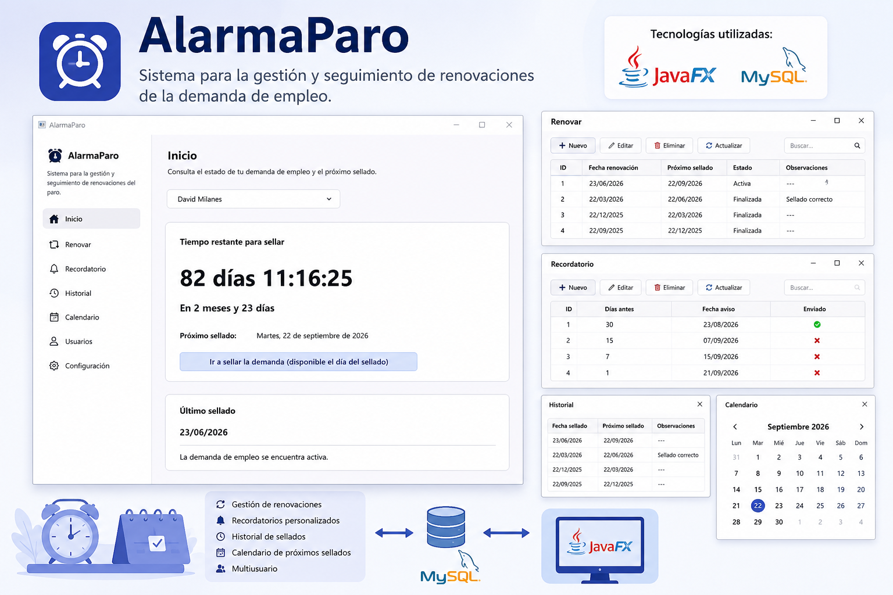

# 🚨 AlarmaParo



> **AlarmaParo** es una aplicación de escritorio desarrollada en **JavaFX** que permite gestionar de forma sencilla la renovación de la demanda de empleo, evitando olvidos mediante un sistema de recordatorios y manteniendo un historial completo de todas las renovaciones realizadas.

---

## 📖 Descripción

El objetivo de este proyecto es ofrecer una herramienta intuitiva para controlar el estado de la demanda de empleo.

La aplicación permite registrar cada renovación, almacenar el historial, configurar recordatorios personalizados y consultar el tiempo restante hasta el próximo sellado, todo ello mediante una interfaz moderna desarrollada con JavaFX y respaldada por una base de datos MySQL.

---

## ✨ Funcionalidades

- 👤 Gestión de usuarios.
- 📅 Registro de renovaciones de la demanda de empleo.
- ✏️ Modificación de renovaciones.
- ❌ Eliminación de renovaciones.
- 🔍 Consulta de renovaciones registradas.
- 🔔 Sistema de recordatorios personalizables.
- 🕒 Cuenta atrás hasta el próximo sellado.
- 📚 Historial completo de renovaciones.
- 🗓️ Calendario con las próximas fechas de renovación.
- 💾 Persistencia de datos mediante MySQL.

---

## 🖥️ Tecnologías utilizadas

| Tecnología | Uso |
|------------|-----|
| ☕ Java | Lenguaje principal |
| 🎨 JavaFX | Interfaz gráfica de escritorio |
| 🗄️ MySQL | Base de datos |
| 🔌 JDBC | Conexión con MySQL |
| 📦 Maven | Gestión de dependencias |
| 🎨 CSS | Personalización de la interfaz |
| 🛠️ Scene Builder | Diseño de las vistas FXML |

---

## 🗄️ Base de datos

La aplicación utiliza **MySQL** como sistema gestor de base de datos para almacenar toda la información de forma persistente.

Se gestionan las siguientes entidades:

- Usuarios
- Renovaciones
- Recordatorios
- Historial
- Calendario

La comunicación entre la aplicación y la base de datos se realiza mediante **JDBC**, implementando el patrón **DAO (Data Access Object)** para separar la lógica de acceso a datos de la interfaz gráfica.

---

## 📌 Operaciones CRUD

El proyecto implementa operaciones completas **CRUD (Create, Read, Update y Delete)** para la gestión de la información.

### Renovaciones

- Crear renovación
- Consultar renovaciones
- Modificar renovación
- Eliminar renovación

### Recordatorios

- Crear recordatorio
- Consultar recordatorios
- Modificar recordatorio
- Eliminar recordatorio

### Usuarios

- Alta de usuarios
- Consulta de usuarios
- Edición de usuarios
- Eliminación de usuarios

---

## 🔔 Sistema de recordatorios

AlarmaParo incorpora un sistema de avisos que permite configurar recordatorios antes de la fecha de renovación de la demanda de empleo.

El usuario puede visualizar en todo momento:

- Tiempo restante hasta el próximo sellado.
- Fecha de la última renovación.
- Próxima fecha de renovación.
- Historial de renovaciones anteriores.

De esta forma se minimiza el riesgo de olvidar renovar la demanda de empleo.

---

## 🚀 Instalación

Clona el repositorio:

```bash
git clone https://github.com/TU_USUARIO/AlarmaParo.git
```

Accede al proyecto:

```bash
cd AlarmaParo
```

Abre el proyecto con **NetBeans** (o cualquier IDE compatible con Maven), configura la conexión con **MySQL**, importa la base de datos y ejecuta la aplicación.

---

## 👨‍💻 Autor

**Soujirito**

Proyecto desarrollado como práctica de ** Software Independiente ** utilizando **JavaFX**, **MySQL** y **JDBC** para implementar una aplicación de escritorio con arquitectura basada en DAO y operaciones CRUD completas.

---

## 📄 Licencia

Este proyecto ha sido desarrollado con fines educativos y de aprendizaje.
